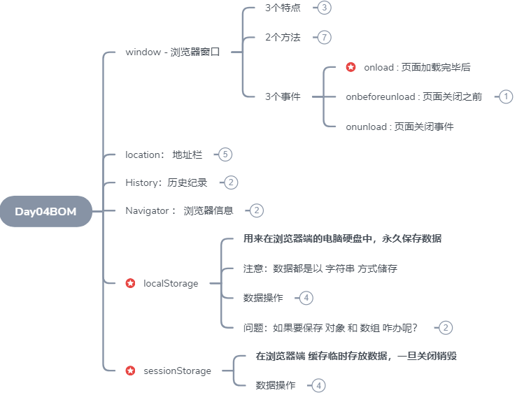
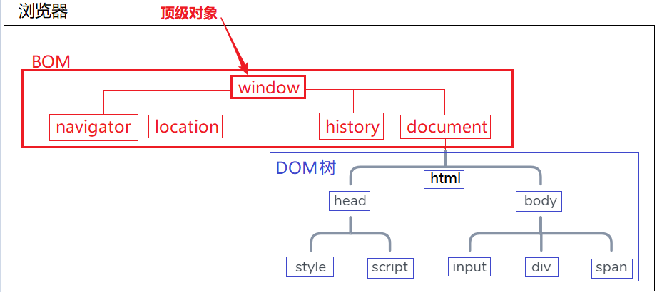
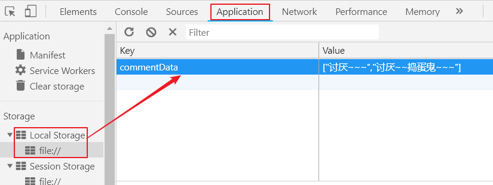
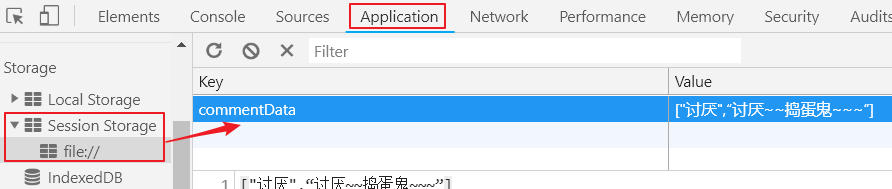
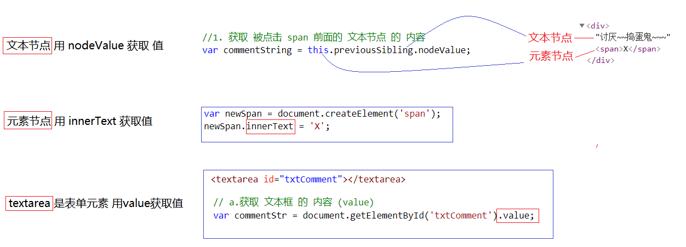
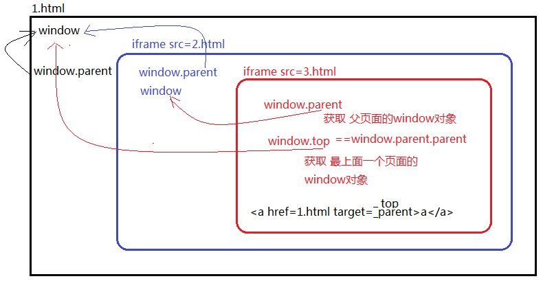

> 第02阶段.前端基本功.前端基础.WebAPI - from：JamesZou

# WebAPI

## 今日学习目标



## 一.核心内容



### 1. window对象

#### 1.1 打开关闭窗口方法

- window.open( url , targe , feather , isHistory )

  - url：要访问的 地址

  - target ： _self      _ blank

  - feather：扩展属性 -- width     height    top    left

  - isHistory：是否 将 这次访问 计入 访问记录

  > 一般使用 window.open('url');

- window.close( );

#### 1.2 三个事件

- 页面加载事件 window.onload  = function(){ }
  - onload 等页面资源加载完毕后才执行
- 页面卸载之前事件 window.onbeforeunload = function(){ }
- 页面关闭事件 window.onunload = fucntion(){}

```js
//1. 网页所有内容加载完毕 （DOM树，所有的外部资源路径）
window.onload = function () {
    //作用： js写在任意位置都可以获取页面元素
    var box = document.getElementById('box');
    console.log(box);
    console.log('页面加载完毕');

};

//2. 页面在即将关闭会执行
window.onbeforeunload = function (e) {
    //作用： 保存重要数据
    alert('页面即将关闭');
};

//3. 页面正在关闭 ： 一走完页面就关闭了
window.onunload = function () {
    //这个方法一走完页面就关闭了
    alert('我正在关闭');

};
```


### 2.location对象

> location 代表 地址栏

#### 2.1 方法

- location.assign( url ) -- 跳转页面 -修改 地址栏的 url
  - location = url
  - location.href = url
- location.replace( url ) -- 替换页面
  - 注意：不会计入 浏览记录
- location.reload() -- 刷新页面

```js
// 1. 跳转页面：命令浏览器 去访问 另一个 页面 上一个页面 ，会 留下 访问 记录，未来 可以 退回
document.getElementById('assign').onclick=function(){
    window.location.assign('http://www.baidu.com');
    // window.location.href = 'http://www.baidu.com';
    // window.location = 'http://www.baidu.com';
}

// 2. 替换页面： 不会留下 访问 记录，未来 不可以 退回 上一个页面
document.getElementById('replace').onclick=function(){
    window.location.replace('http://www.baidu.com');
}

// 3. 刷新页面（f5）
document.getElementById('reload').onclick=function(){
    window.location.reload();
}
```


#### 2.2 属性

- location.search：url参数字符串 -- ''?id=1&uName=Linda'
- 注意：面试时容易出现 要求 将 search 字符串转成 对象 { id:1 , uName:'Linda' }

### 3.history对象

> 浏览器的 访问记录对象

- history.back()  -- 返回上一个页面
- history.forward() -- 前往 下一个页面  -- 人间到天堂，天堂 back 人间，人间 forward 天堂

### 4. navigator 对象

> 浏览器信息对象，保存了 浏览器的 很多信息 和 操作系统信息

- navigator.userAgent -- 获取 浏览器版本信息

```js
if(window.navigator.userAgent.indexOf('Chrome') > -1){
    console.log('谷歌浏览器~~~~');
}else{
    console.log('不是 谷歌浏览器~~~');
}
```

### 5. localStorage对象

> 用来在浏览器端的电脑硬盘中 永久保存数据

- 存数据        **localStorage.setItem( key , value );**

  - 数据都是以 字符串 方式储存

  - 问：如果要保存 对象 和 数组 咋办呢？

  - 答：先将 对象和数组 通过 JSON对象的方法 转成 json字符串

    ​         读取出来 也需要听过 JONS对象的方法 将 json字符串 转成 对象和数组

- 读取数据 **localStorage.getItem( key )**

  - 如果 没有获取到 ，返回 null

- 删除数据 **localStorage.removeItem( key )**

- 清空所有数据 **localStorage.clear();**


> 可以通过 浏览器工具查看数据

```js
localStorage.set('commentData','["讨厌",“讨厌~~捣蛋鬼~~~”]');
```



### 6. sessionStorage 对象

> 在浏览器端 临时保存数据，数据存在 浏览器 缓存，一旦关闭 就销毁了！！！

- 存数据        sessionStorage .setItem( key , value );
- 读取数据    sessionStorage .getItem(key)
  - 如果 没有获取到 ，返回 null
- 删除数据 sessionStorage .removeItem( key )
- 清空所有数据 sessionStorage .clear();

```js
sessionStorage.set('commentData','["讨厌",“讨厌~~捣蛋鬼~~~”]');
```



## 二.扩展内容

### 1.不同类型节点获取值的方式



### 2.window的两个属性

+ 两个属性
  + parent -- 获取 iframe 页面的 父窗口
  + top --      获取 iframe 页面的 最顶级窗口

